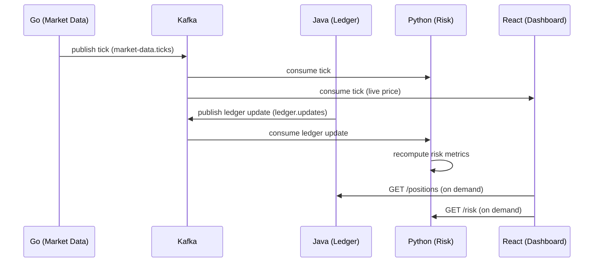

# Event Flow: Tick to Dashboard

## Flow diagram

## Narrative

1. Go ingests a market tick and publishes it to `market-data.ticks`.
2. Python and the dashboard both consume the tick independently — Python for
   risk recalculation, the dashboard for the live price ticker.
3. When a trade executes, Java writes it to the ledger and publishes to
   `ledger.updates`.
4. Python consumes ledger updates too, since risk metrics depend on current
   positions, not just prices.
5. The dashboard pulls positions/balances from Java and risk metrics from
   Python via REST — these are on-demand "current state" queries, not
   streamed events (per the transport decision).